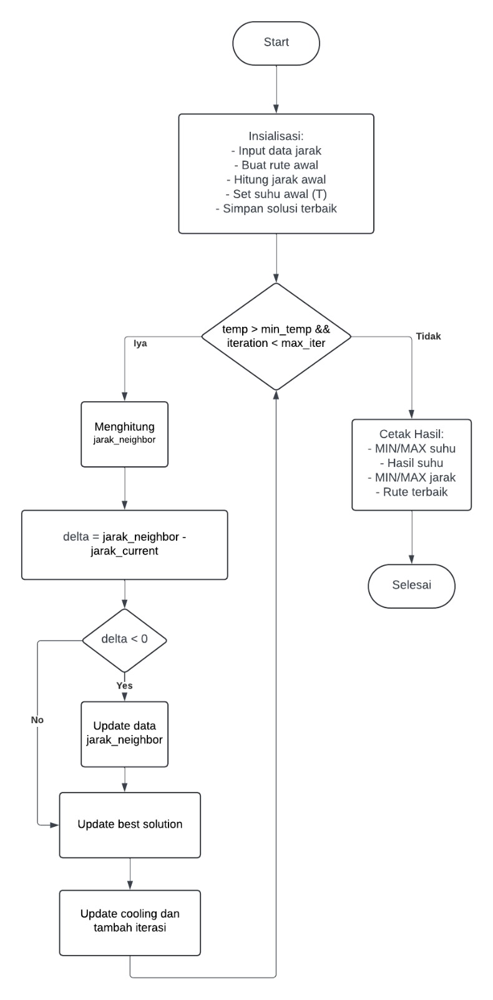

# Simulated Annealing for Route Optimization

A Python implementation of the Simulated Annealing algorithm to solve the Traveling Salesman Problem (TSP) with fixed start and end points. This project optimizes routes between multiple locations, starting from "Ojan" and ending at "Kampus".

## 🎯 Problem Description

This implementation solves a routing optimization problem where:
- **Start Point**: Ojan's location (index 0)
- **End Point**: Kampus (index 7) 
- **Intermediate Stops**: 6 other locations (Naufal, Gideon, Wildy, Dhafin, Shofa, Tiara)
- **Objective**: Find the shortest total distance visiting all locations

## 🚀 Features

- **Fixed Start/End Points**: Ensures routes always begin at Ojan and end at Kampus
- **Real Distance Data**: Uses actual distance matrix between locations
- **Comprehensive Tracking**: Monitors temperature and distance statistics
- **Human-Readable Output**: Displays routes with location names
- **Configurable Parameters**: Adjustable temperature, cooling rate, and iteration limits

## 📊 Algorithm Overview

### Simulated Annealing Process

1. **Initialization**: Create sequential route and shuffle middle cities
2. **Neighbor Generation**: Swap two random middle cities
3. **Acceptance Criteria**: 
   - Always accept better solutions (shorter distances)
   - Probabilistically accept worse solutions using: `e^(-Δ/T)`
4. **Cooling Schedule**: Geometric cooling with rate 0.95
5. **Termination**: When temperature reaches minimum or max iterations

### Key Parameters

- **Initial Temperature**: 1000°
- **Cooling Rate**: 0.95 (5% reduction per iteration)
- **Minimum Temperature**: 0.1°
- **Maximum Iterations**: 1000

## 🗺️ Distance Matrix

The algorithm uses real distance data (in kilometers) between 8 locations:

| Location | Index | Description |
|----------|-------|-------------|
| Ojan     | 0     | Starting point |
| Naufal   | 1     | Intermediate stop |
| Gideon   | 2     | Intermediate stop |
| Wildy    | 3     | Intermediate stop |
| Dhafin   | 4     | Intermediate stop |
| Shofa    | 5     | Intermediate stop |
| Tiara    | 6     | Intermediate stop |
| Kampus   | 7     | Final destination |

## 📈 Algorithm Flowchart



## 🏃‍♂️ Usage

### Prerequisites
- Python 3.x
- Standard libraries: `random`, `math`, `copy`

### Running the Algorithm

```bash
python app.py
```

### Sample Output

```
MIN Suhu: 0.10
MAX Suhu: 1000.00
Suhu Akhir: 0.10
MIN Jarak: 16.60
MAX Jarak: 32.40
Best Jarak: 16.60
Total Iterasi: 180

Rute Terbaik: [0, 4, 1, 5, 6, 3, 2, 7]
Rute dengan Nama: Ojan -> Dhafin -> Naufal -> Shofa -> Tiara -> Wildy -> Gideon -> Kampus
Jarak Total Terbaik: 16.60 km

Catatan: Rute dimulai dari Ojan dan berakhir di Kampus
```

## 🔧 Code Structure

### Main Functions

- **`calculate_distance(route, distance_matrix)`**: Calculates total route distance
- **`generate_neighbor(route)`**: Creates neighbor solution by swapping cities
- **`simulated_annealing(distance_matrix, ...)`**: Main optimization algorithm

### Key Variables

- **`current_route`**: Current solution being evaluated
- **`best_route`**: Best solution found so far
- **`temp`**: Current temperature for acceptance probability
- **`delta`**: Difference between current and neighbor solution

## 📊 Performance Metrics

The algorithm tracks and reports:
- **Temperature Statistics**: MIN, MAX, and final temperature
- **Distance Statistics**: MIN, MAX, and best distance found
- **Iteration Count**: Total iterations completed
- **Route Quality**: Numerical and named route representation

## 🎛️ Customization

You can modify the algorithm by adjusting:

```python
# In simulated_annealing function call
best_route, best_dist = simulated_annealing(
    distance_matrix,
    initial_temp=1000,    # Starting temperature
    cooling_rate=0.95,    # Cooling factor (0-1)
    min_temp=0.1,         # Stopping temperature
    max_iter=1000         # Maximum iterations
)
```

## 🔄 Algorithm Complexity

- **Time Complexity**: O(n × iterations) where n is number of cities
- **Space Complexity**: O(n) for storing routes and distance matrix
- **Typical Runtime**: 180-300 iterations for convergence

## 🎓 Educational Value

This implementation demonstrates:
- **Metaheuristic Optimization**: Simulated Annealing technique
- **Probabilistic Acceptance**: Escaping local optima
- **Cooling Schedules**: Balancing exploration vs exploitation
- **Constrained Optimization**: Fixed start/end points
- **Real-world Application**: Route planning and logistics

## 📝 License

This project is open source and available under the MIT License.

---

**Note**: This implementation is designed for educational purposes and small-scale routing problems. For large-scale commercial applications, consider more advanced TSP algorithms or optimization libraries.
